# Visual Intex

## 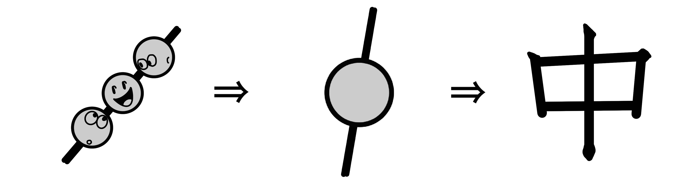
- kanjiMiddle01 (20240328)
- Tags: kanji, naka, middle
- Files: [`png`](images/kanjiMiddle01.png)

## 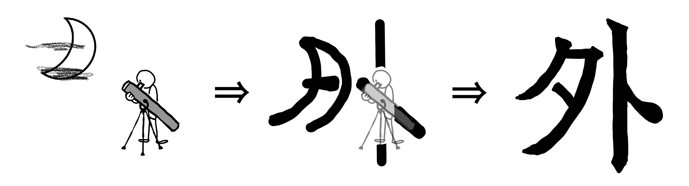
- kanjiOutside01 (20240328)
- Tags: kanji, soto, outside
- Files: [`png`](images/kanjiOutside01.png)

## 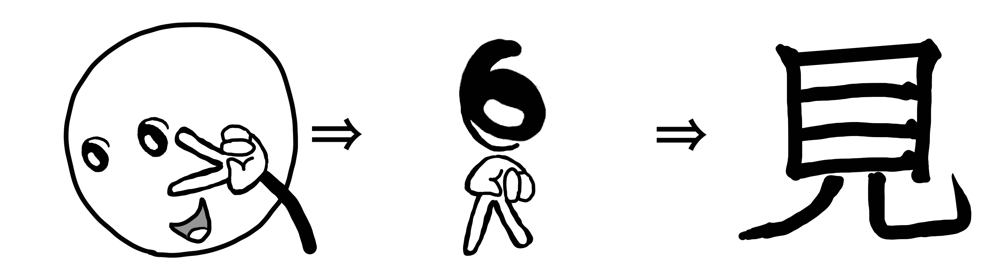
- kanjiMiru01 (20240329)
- Tags: kanji, miru, see
- Files: [`png`](images/kanjiMiru01.png)

## 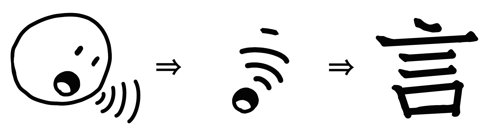
- kanjiIu01 (20240329)
- Tags: kanji, iu, say
- Files: [`png`](images/kanjiIu01.png)

## 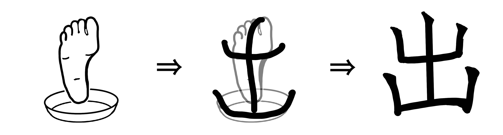
- kanjiDeru01 (20240329)
- Tags: kanji, deru, exit
- Files: [`png`](images/kanjiDeru01.png)

## 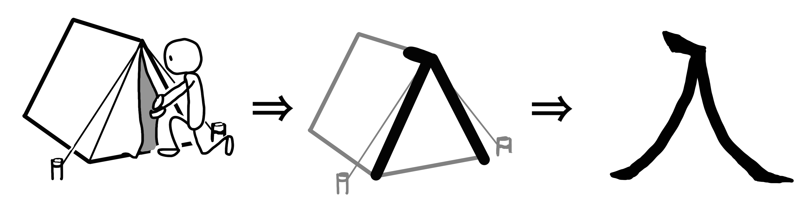
- kanjiHairu01 (20240329)
- Tags: kanji, hairu, enter
- Files: [`png`](images/kanjiHairu01.png)

## 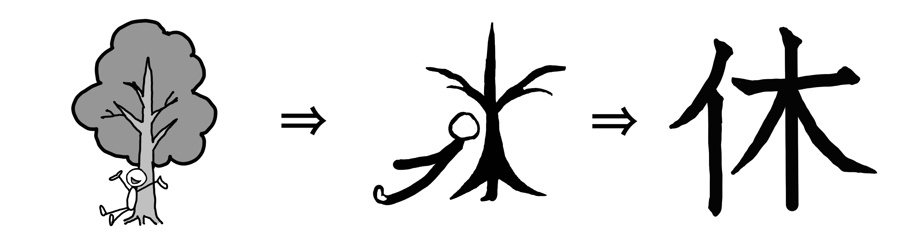
- kanjiYasumu01 (20240330)
- Tags: kanji, yasumu, rest
- Files: [`png`](images/kanjiYasumu01.png)

## 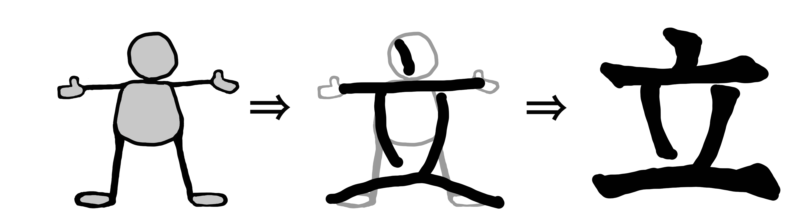
- kanjiTatsu01 (20240330)
- Tags: kanji, tatsu, stand
- Files: [`png`](images/kanjiTatsu01.png)

## 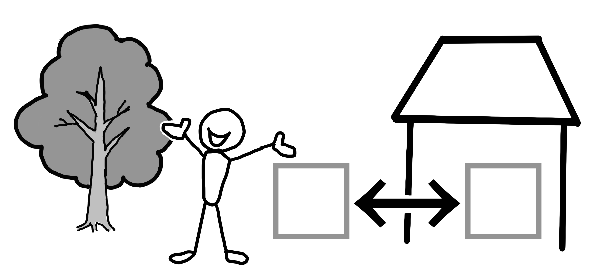
- kanjiNakaSoto01 (20240330)
- Tags: kanji, naka, soto, inside, outside
- Files: [`png`](images/kanjiNakaSoto01.png)

## 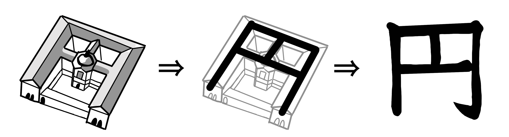
- kanjiYen01 (20240330)
- Tags: kanji, yen, currency
- Files: [`png`](images/kanjiYen01.png)

## 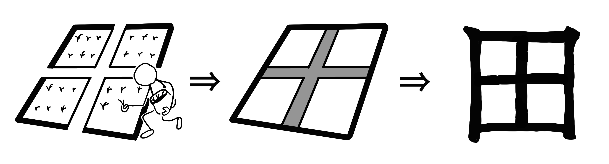
- kanjiTa01 (20240330)
- Tags: kanji, ta, rice field
- Files: [`png`](images/kanjiTa01.png)

## 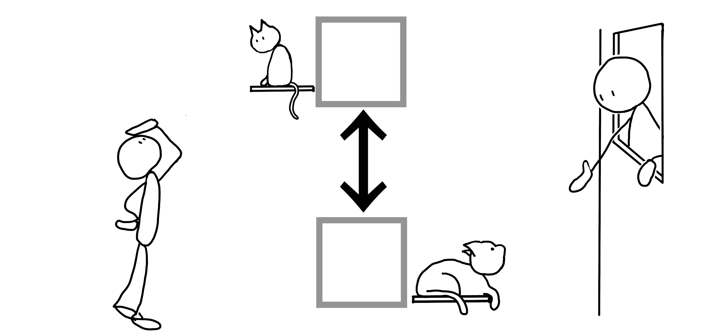
- kanjiUeShita01 (20240330)
- Tags: kanji, ue, shita, up, down, upper, lower
- Files: [`png`](images/kanjiUeShita01.png)

## 
- thought2waka02 (20250612)
- Tags: waka, poem, thought, perception
- Files: [`png`](images/thought2waka02.png), [`svg`](images/thought2waka02.svg), [`pdf`](images/thought2waka02.pdf)

## 
- thought2waka01 (20250515)
- Tags: waka, poem, thought, perception
- Files: [`png`](images/thought2waka01.png), [`svg`](images/thought2waka01.svg), [`pdf`](images/thought2waka01.pdf)

## 
- kabukiStickers01 (20250512)
- Tags: sticker, kabuki, culture, isct
- Files: [`png`](images/kabukiStickers01.png), [`svg`](images/kabukiStickers01.svg), [`pdf`](images/kabukiStickers01.pdf)

## 
- bustour01 (20241201)
- Tags: Bus, tour, event, isct
- Files: [`png`](images/bustour01.png), [`svg`](images/bustour01.svg), [`pdf`](images/bustour01.pdf)

## 
- tasuki-gake01 (20250415)
- Tags: process, grammar, model, tasuki-gake
- Files: [`png`](images/tasuki-gake01.png), [`svg`](images/tasuki-gake01.svg), [`pdf`](images/tasuki-gake01.pdf)

## 
- show-and-tell01 (20250326)
- Tags: show, tell, visual, explanation
- Files: [`png`](images/show-and-tell01.png), [`svg`](images/show-and-tell01.svg), [`pdf`](images/show-and-tell01.pdf)

## 
- colloqjseal01 (20241201)
- Tags: colloqj, seal, sticker, expression
- Files: [`png`](images/colloqjseal01.png), [`svg`](images/colloqjseal01.svg), [`pdf`](images/colloqjseal01.pdf)

