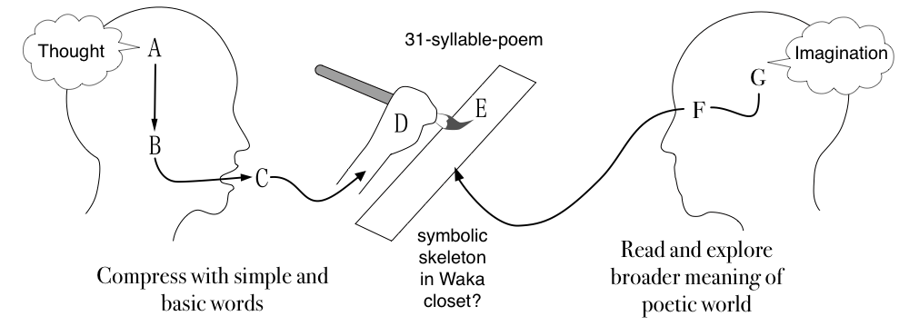
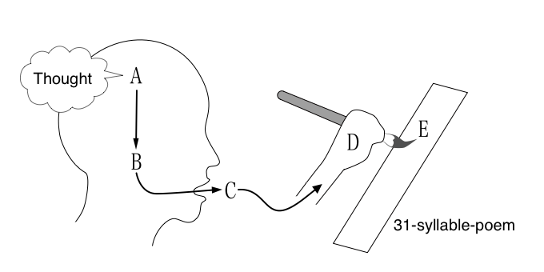
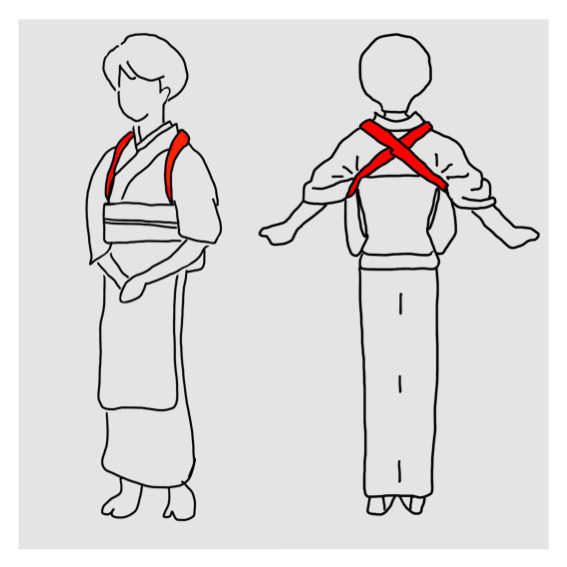
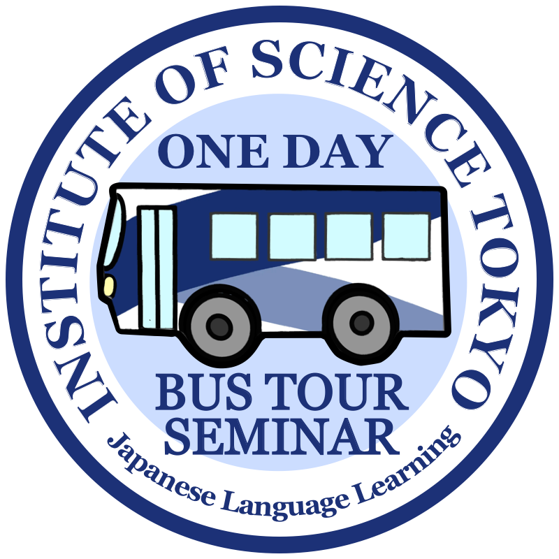

# Table of Contents

Last change: 2025/10/19-14:28:18.

Hilofumi Yamamoto, Ph.D. Institute of Science Tokyo

Welcome to visual-notes, a collection of sketches, diagrams, and images that reflect thoughts I chose not to put into words.
---

## 📅 Entries

<prettier-ignore>

1. :
   [svg](./images/thought2waka02.svg)
   [pdf](./images/thought2waka02.pdf)
   [png](./images/thought2waka02.png)
   2025-06-12 thought2waka02
   A waka poem reflecting on thought and perception
1. :
   [svg](./images/thought2waka01.svg)
   [pdf](./images/thought2waka01.pdf)
   [png](./images/thought2waka01.png)
   2025-05-15 thought2waka02
   A waka poem reflecting on thought and perception
1. :
   [svg](./images/kabukiStickers01.svg)
   [pdf](./images/kabukiStickers01.pdf)
   [png](./images/kabukiStickers01.png)
   2025-05-12 kabukiStickers01 
   sticker kabuki culture isct 
1. :
   [svg](./images/tasuki-gake01.svg)
   [pdf](./images/tasuki-gake01.pdf)
   [png](./images/tasuki-gake01.png)
   2025-04-15 tasuki-gake01 Process Grammar Model tasuki-gake effect 
1.  :
   [png](./images/showandtell01.png)
   2025-03-26 showandtell01
   Show and Tell, visual explanation concept, speech idea
1. :
   [svg](./images/bustour01.svg)
   [pdf](./images/bustour01.pdf)
   [png](./images/bustour01.png)
   2024-12-01 bustour01
    Bus tour event isct
1. :
    [svg](./images/colloqjseal01.svg)
    [pdf](./images/colloqjseal01.pdf)
    [png](./images/colloqjseal01.png)
    2024-12-01 colloqjseal01
    ColloQ-J seal sticker aead colloquial Japanese expresions

